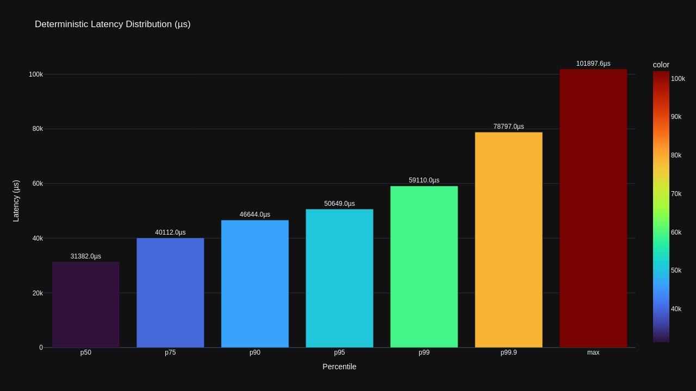
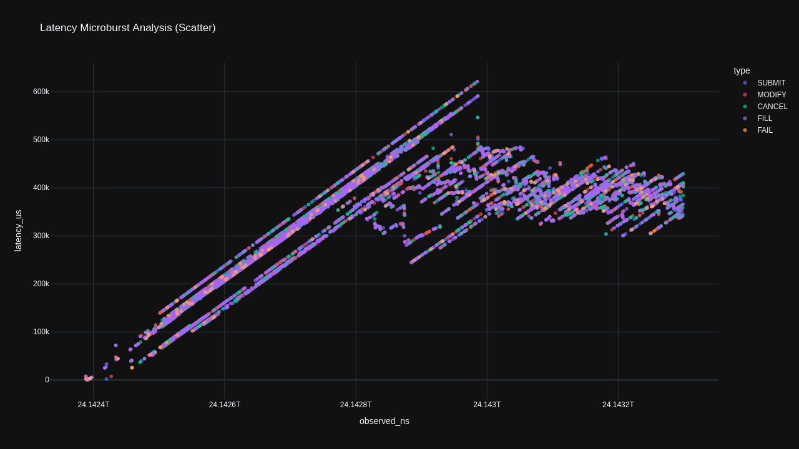
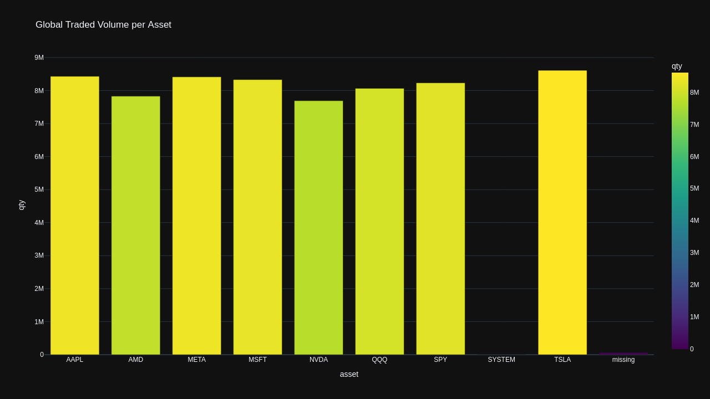
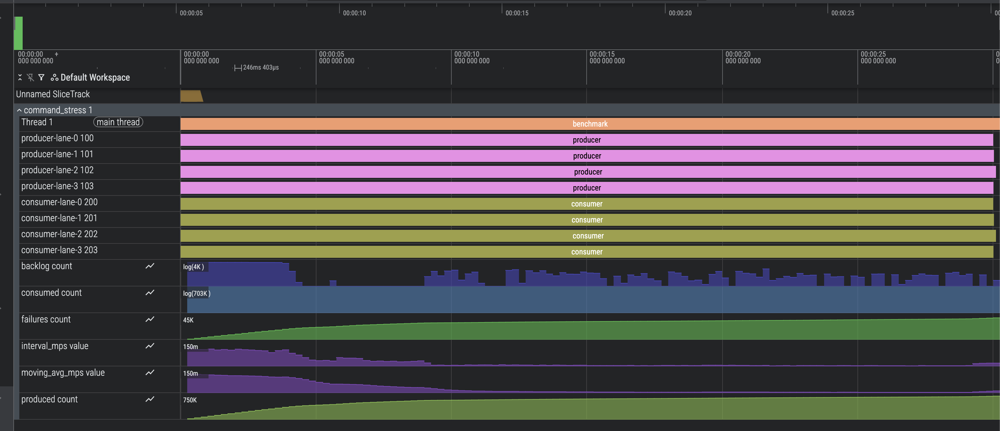
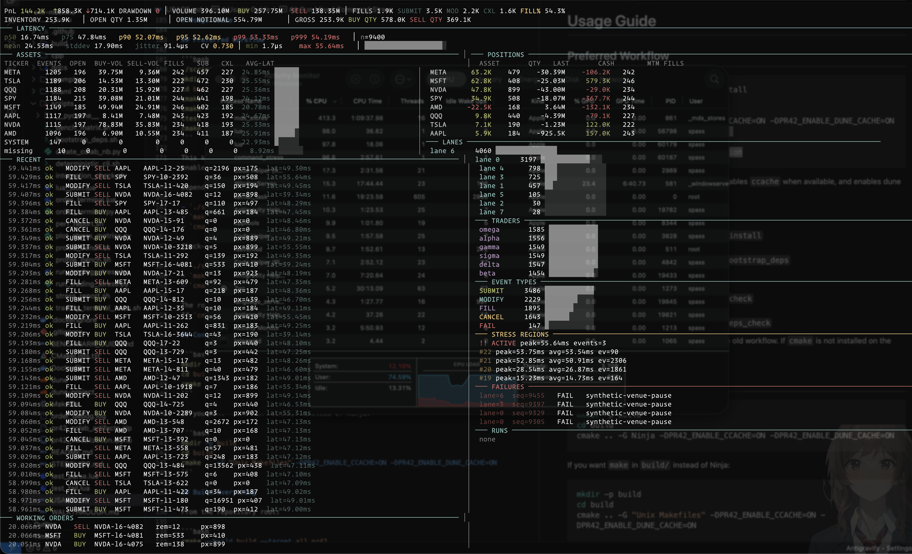
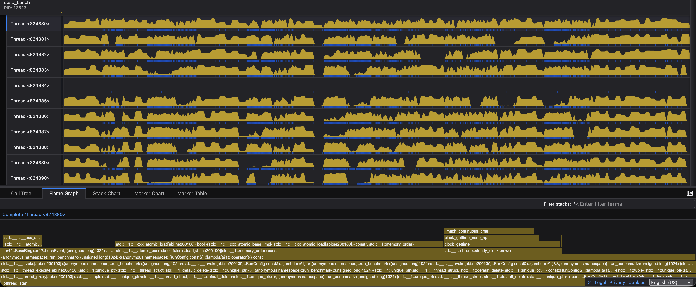
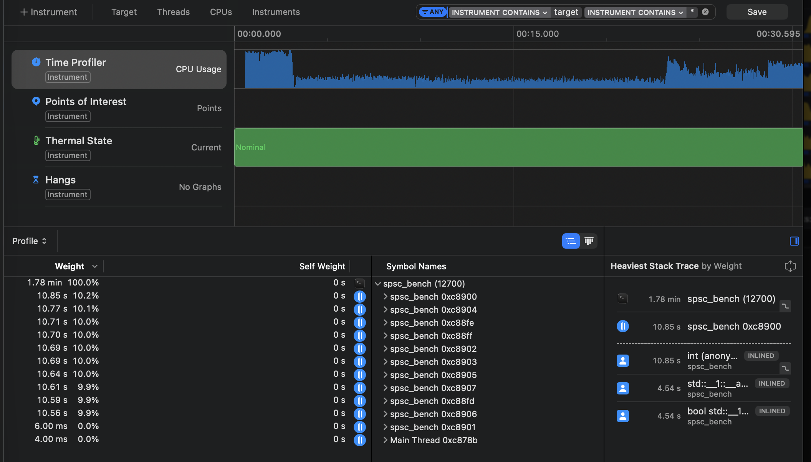

# SMR Machine

Cache-aware C++20 SPSC transport with a deterministic OCaml replay engine. The transport emits bounded incident windows as portable `.pr42` artifacts. The replay engine ingests them, applies transitions in source order, checkpoints at configurable sequence intervals, and validates rollback integrity via canonical snapshot hashing. A Lua operator terminal consumes the live event stream. No shared runtime across components — the artifact is the only cross-language interface.

---

## Transport — C++20 SPSC Ring

Power-of-two ring with one-slot-empty full/empty discrimination. Producer owns `head`, consumer owns `tail` — neither index is read by the opposite side outside of its own acquire/release fence on the slot sequence counter. `alignas(64)` separation on producer state, consumer state, and the slot array eliminates false sharing structurally. `store(release)` post-write on slot sequence; `load(acquire)` pre-read. No `seq_cst`. No mutex.

Multi-lane execution under configurable stress-thread count. Throughput figures reflect L2/L3 contention at real producer/consumer concurrency, not single-thread ceiling math.

### Measurements — `docs/bench_results.md`

| messages | capacity | ns/message | throughput (M msg/s) |
|---|---|---:|---:|
| 200,000 | 256 | 15.579 | 64.187 |
| 200,000 | 1,024 | 15.783 | 63.359 |
| 200,000 | 4,096 | 13.056 | 76.594 |
| 1,000,000 | 256 | 16.922 | 59.094 |
| 1,000,000 | 1,024 | 23.289 | 42.939 |
| 1,000,000 | 4,096 | 10.696 | 93.493 |

---

## Stress Run — Core Metrics

```
Total Messages : 728,064
Mean Latency   : 23,691.08 µs
Jitter         : 0.0030 MPS
```

Throughput and backlog sampled at 250ms resolution across the full run duration. Backlog accumulation is the primary signal for producer/consumer skew under lane-count and stress-thread scaling:

<p align="center">
  
</p>

Microburst latency scatter isolates the tail behavior that aggregate percentiles suppress. Each point is a single message; vertical clustering indicates coordinated stall events across lanes — distinguishable from random jitter by temporal density:

<p align="center">
  
</p>

Stress window. Distribution reflects the configured command weights (`SUBMIT 28 / MODIFY 30 / CANCEL 22 / FILL 18 / FAIL 2`) and invalid-action injection at 15bps:

<p align="center">
  
</p>

### Per-run telemetry artifacts

- `timeline.csv` — interval throughput and backlog at configurable sampling resolution
- `latency_histogram.csv` — full distribution, p50/p95/p99
- `trace_event.json` — Chrome/Perfetto event stream
- `summary.json` — aggregate throughput, jitter, latency

The Perfetto timeline surfaces lane-level event density and stall windows for cross-lane correlation:

<p align="center">
  
</p>

---

## Replay Engine — OCaml State Machine

State per replay context: per-trader position table, active order map (order ID → remaining quantity), realized PnL and VWAP entry price per trader, monotone sequence counter, checkpoint snapshots with canonical SHA digest.

Transitions are a pure function of the command sequence — no wall-clock participation. Snapshots canonicalized before hashing; map insertion order has no effect on digest stability. Illegal transitions and `FAIL` events are preserved at their exact source sequence numbers, not filtered. Rollback resolves to the latest checkpoint `≤ N` and reapplies forward — hash-stable across invocations.

The `.pr42` format is the complete cross-language contract. C++ serializes a bounded event window post-failure. OCaml ingests, replays, and validates checkpoint hashes. No FFI. Replay is portable to any machine with the artifact and the binary.

---

## Stress Harness — `command_stress`

Randomized `SUBMIT`, `MODIFY`, `CANCEL`, `FILL`, `FAIL` traffic with per-command probability weights, invalid-action injection at basis-point granularity, seeded RNG, and bounded replay window capture anchored to the first failure per lane.

Artifacts:

- `summary.json`
- `timeline.csv`
- `raw_events.jsonl`
- `raw_events.stream.jsonl`
- `trace_event.json`
- `replays/failure_*.pr42`

---

## Operator Terminal — Lua

tmux-launched terminal. Tails `raw_events.stream.jsonl`, reads `status.json`, maintains append-only run history, exposes `replays/` for immediate drill-down. Failure windows are capturable and replayable without a separate collection step.

<p align="center">
  
</p>

---

## Profiling

- `xctrace` / `sample` — macOS stack inspection during live runs
- `samply` — browser-based flamegraph
- `trace_event.json` — Perfetto/Chrome timeline
- `timeline.csv`, `latency_histogram.csv` — distribution analysis

<p align="center">
  
</p>

<p align="center">
  
</p>

See [`docs/profiling.md`](docs/profiling.md).

---

## Build

```bash
./scripts/bootstrap_deps.sh --install
cmake -S . -B build -G Ninja -DSMR_MACHINE_ENABLE_CCACHE=ON -DSMR_MACHINE_ENABLE_DUNE_CACHE=ON
cmake --build build --target all_smr_machine
ctest --test-dir build --output-on-failure
cmake --build build --target integration
```

Build products:

- `build/spsc_bench`
- `build/command_stress`
- `build/generate_scenario`
- `_build/default/ocaml/bin/deterministic_cli.exe`

---

## Usage

```bash
# Deterministic replay with checkpoint and rollback
bash scripts/deterministic_cli.sh replay examples/loss_scenario.pr42 --checkpoint 2 --rollback-seq 6

# Sustained transport benchmark
./build/spsc_bench \
  --duration-sec 10 --capacity 1024 --lanes 4 \
  --stress-threads 2 --stress-bytes 33554432 \
  --report-interval-ms 250 \
  --timeline-csv build/spsc_bench.timeline.csv \
  --latency-histogram-csv build/spsc_bench.latency_histogram.csv \
  --trace-event-json build/spsc_bench.trace_event.json

# Market-style failure generation
lua scripts/run_trading_stress.lua \
  --artifact-dir build/trading_terminal \
  --duration-sec 60 --capacity 4096 --lanes 12 \
  --stress-threads 8 --stress-bytes 134217728 \
  --report-interval-ms 250 --failure-limit 250 --replay-window 5000 \
  --submit-weight 28 --modify-weight 30 --cancel-weight 22 \
  --fill-weight 18 --fail-weight 2 --invalid-bps 15 --seed 123

# Live terminal
lua scripts/order_terminal.lua \
  --event-log build/trading_terminal/raw_events.jsonl \
  --event-stream-log build/trading_terminal/raw_events.stream.jsonl \
  --status-json build/trading_terminal/status.json \
  --run-history-jsonl build/trading_terminal/run_history.jsonl \
  --refresh-ms 100

# Replay captured failure window
bash scripts/deterministic_cli.sh \
  replay build/trading_terminal/replays/failure_1_lane_0.pr42 \
  --checkpoint 4 --rollback-seq 12
```
- [ NOTEBOOK ](https://colab.research.google.com/drive/1EwSuFiWDzpiAqvNtf_64twUATRFTapEQ)
---

## Reference

- [Usage Guide](USAGE.md)
- [Technical Design](docs/design.md)
- [Benchmark Results](docs/bench_results.md)
- [Profiling Notes](docs/profiling.md)
- [Artifact Reference](docs/artifact_reference.md)
- [Walkthrough](WALKTHROUGH.md)
