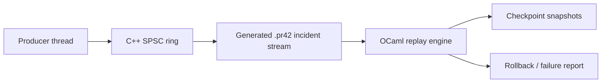

# Technical Design Write-Up

## Problem Statement

Trading systems often fail under the worst possible conditions: pathological loss events, venue disconnects, and expensive downstream recovery. The system needs two things at once:

1. deterministic reproduction of state transitions for post-mortem analysis;
2. low-latency transport for high-frequency event movement.

`State Machine Replication` separates those concerns cleanly. C++ handles fast in-memory transfer while OCaml handles auditable, deterministic replay of business state.

## Architecture

## OCaml Replay Engine

The replay engine is intentionally deterministic:

- commands are applied in source order;
- there is no wall-clock dependence in state transitions;
- snapshots are canonicalized by sorting positions and orders before hashing;
- failures are preserved as `(sequence, reason)` pairs.

This makes reproduction stable across repeated executions of the same event script.

### State Model

- `positions`: trader inventory, cash, realized PnL, and average entry price.
- `orders`: active order map with remaining open quantity.
- `seq`: monotonically increasing replay index.

### PnL Semantics

The replay engine uses a weighted-average entry price for same-direction fills, realizes PnL only on the matched quantity when reducing or flipping a position, and resets the entry price when inventory goes flat. That behavior is simple enough to defend in an interview and strict enough to avoid hand-wavy accounting.

### Rollback Strategy

Checkpointing trades extra memory for forensic speed. The current implementation stores snapshot copies at a configurable interval and supports rollback to the latest checkpoint at or before a target sequence.

This is a reasonable interview tradeoff because:

- replay logic remains easy to reason about;
- rollback is cheap to explain and test;
- extensions such as delta-compressed checkpoints are straightforward.

## C++ SPSC Ring Buffer

The ring buffer is designed around standard SPSC invariants:

- only the producer writes `head_`;
- only the consumer writes `tail_`;
- cross-thread visibility uses release/acquire ordering;
- cached peer indices reduce repeated atomic loads in the common case.

### False-Sharing Mitigation

The implementation places storage and index variables on separate cache-line boundaries with `alignas(64)`. This is a practical measure for latency-sensitive paths where unnecessary coherence traffic can dominate short critical sections.

### Capacity Model

The queue reserves one slot to distinguish full from empty. For capacity `N`, at most `N - 1` messages can be resident at once.

## Profiling Strategy

The benchmark provides a stable binary for:

- throughput measurement;
- coarse nanoseconds-per-message tracking;
- portable trace-event JSON and histogram/telemetry CSV export;
- Time Profiler inspection with `xctrace` on macOS;
- targeted process sampling with `sample` or DTrace on macOS.

The integration path also gives a concrete story for interviews: low-latency capture in C++, deterministic diagnosis in OCaml, shared through a reproducible incident artifact.

See [profiling.md](/Users/spass/ws/smr-machine/docs/profiling.md) for operational commands.

## Extension Ideas

- add binary event capture shared between C++ and OCaml;
- add Linux `perf` or `magic-trace` capture support for true off-host stack flamegraphs;
- persist checkpoints to mmap-backed storage;
- integrate order-book style matching rather than direct fills.
